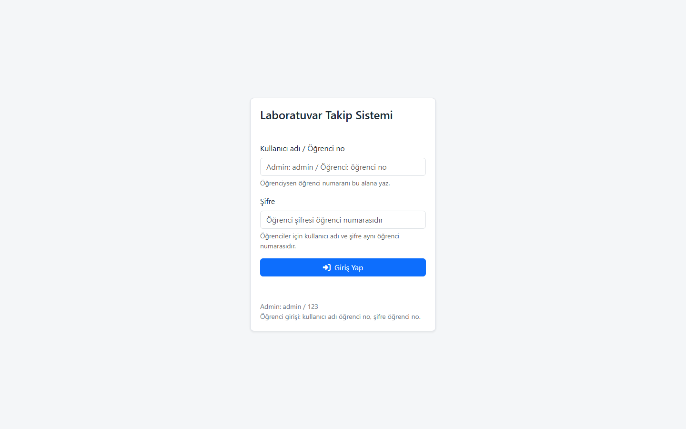
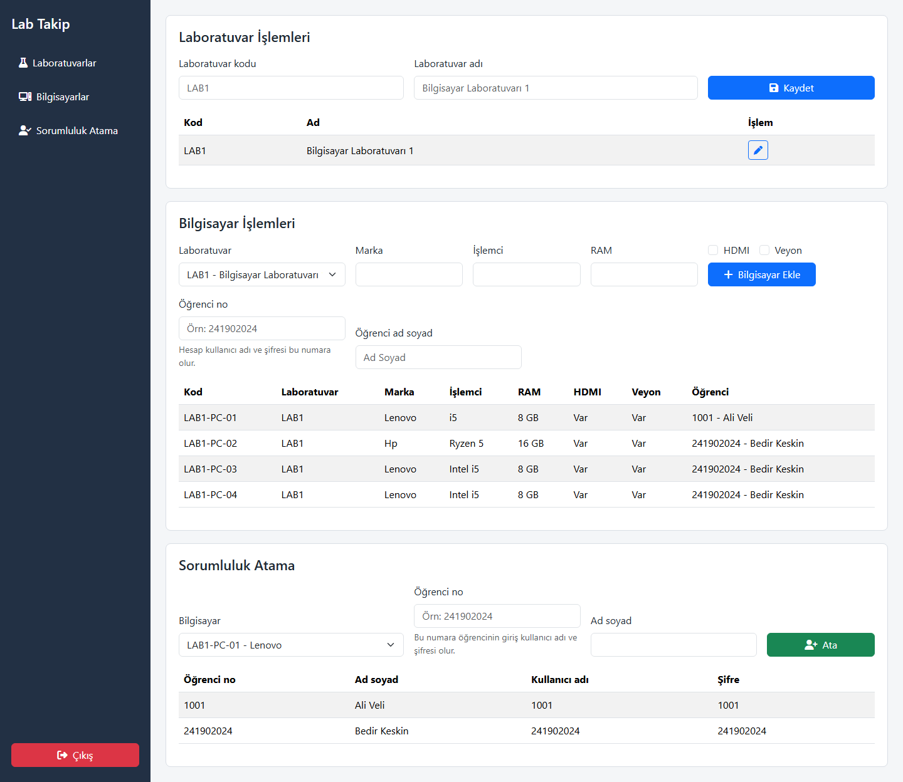
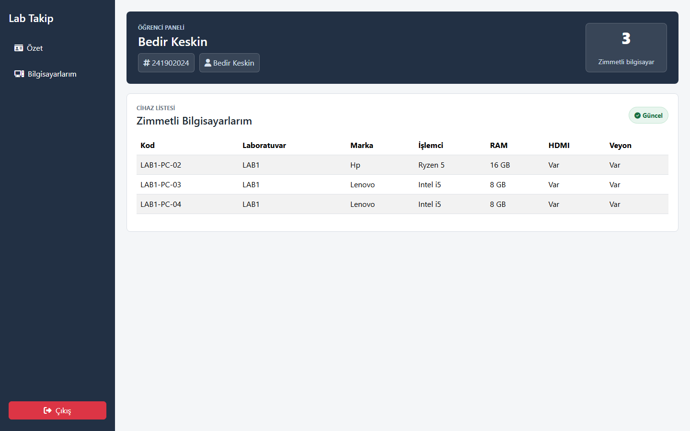

# Laboratuvar Takip Sistemi

Bu proje, bilgisayar laboratuvarlarındaki bilgisayarların kayıt altına alınması ve öğrencilerin belirli bilgisayarlara sorumlu olarak atanması için geliştirilmiş bir ASP.NET Core web uygulamasıdır. Admin kullanıcı laboratuvar ve bilgisayar ekleyebilir, öğrenci numarası ve ad-soyad bilgisiyle sorumluluk ataması yapabilir. Öğrenci atandığında sisteme giriş yapabileceği kullanıcı hesabı otomatik oluşturulur.

## Kullanılan Teknolojiler

- ASP.NET Core 8
- Entity Framework Core
- SQLite
- HTML, CSS, JavaScript
- Bootstrap

## Projeyi Çalıştırma

1. Bilgisayarınızda .NET 8 SDK kurulu olmalıdır.
2. Proje klasöründe terminal açın.
3. Aşağıdaki komut ile projeyi çalıştırın:

```bash
dotnet run --project BedirKeskin/BedirKeskin.csproj --launch-profile http
```

4. Tarayıcıdan aşağıdaki adrese gidin:

```text
http://localhost:5269/login.html
```

## Giriş Bilgileri

Admin girişi:

```text
Kullanıcı adı: admin
Şifre: 123
```

Öğrenci girişi için kullanıcı adı ve şifre öğrencinin numarasıdır. Örneğin:

```text
Kullanıcı adı: 241902024
Şifre: 241902024
```

## Kısa Kullanım Açıklaması

Admin panelinde önce laboratuvar bilgileri tanımlanır. Daha sonra bilgisayar bilgileri eklenir. Bilgisayar ekleme sırasında öğrenci no ve ad-soyad bilgisi girilirse öğrenci o bilgisayara atanır ve öğrenci hesabı otomatik oluşturulur. Alternatif olarak "Sorumluluk Atama" bölümünden mevcut bir bilgisayar seçilerek öğrenci ataması yapılabilir.

Öğrenci kendi hesabıyla giriş yaptığında yalnızca kendisine zimmetlenen bilgisayarları görüntüler.

## Ekran Görüntüleri

### Giriş Ekranı



### Admin Paneli



### Öğrenci Paneli


